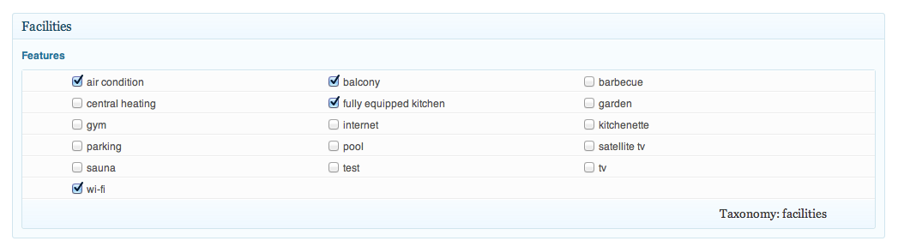
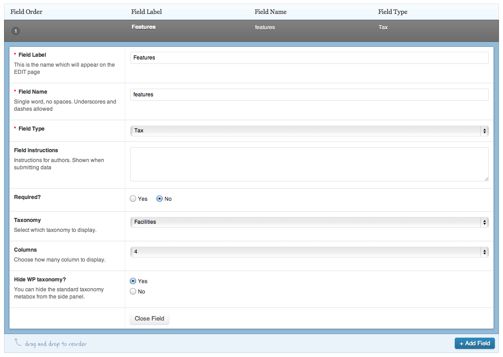

# [Taxonomy add-on for ACF plugin (WP)](https://github.com/FutureMedia/acf-tax)

**Tax** is a simple add-on for the ACF ([Advanced Custom Fields](http://www.advancedcustomfields.com/)) WP plugin that lets you set the taxonomies of a post in a custom metabox.

The Tax add-on generates elegant lists of check-boxes that can be formated in a number of user selected columns to save space. 

##Installation

Move the acf-tax.php file in your theme folder. To activate just add 

<pre><code>
	register_field(‘Categories_field’, dirname(__File__) . ‘/categories.php’);
</code></pre>

in your functions file and you're ready to go.

## License

Public Domain

